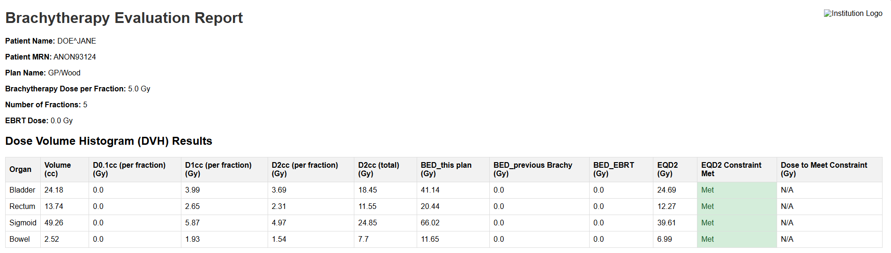

# BrachyD2ccEval User Manual

## 1. Introduction

The BrachyD2ccEval tool is a software application designed to streamline the evaluation of HDR brachytherapy plans, particularly for cases planned using Oncentra. It automates the process of calculating dose-volume histogram (DVH) metrics, Biological Effective Dose (BED), and Equivalent Dose in 2 Gy fractions (EQD2), providing a comprehensive report for clinical review.

### Key Features:

*   Automated parsing of DICOM RT Dose, RT Structure Set, and RT Plan files.
*   Calculation of critical DVH metrics, including D2cc, D1cc, and D0.1cc.
*   Integration of External Beam Radiation Therapy (EBRT) and previous brachytherapy doses.
*   Evaluation of treatment plans against predefined constraints (based on EMBRACE II).
*   **Plan Type-Based Constraint Management:** Dynamically manages and applies constraints based on predefined plan types, allowing for flexible and accurate evaluation across different treatment scenarios.
*   **Interactive Dose Point Mapping:** Provides a user-friendly interface to manually map DICOM RT Plan points to clinical constraints using dropdown menus, offering greater control and flexibility over the evaluation process, now enhanced with automatic pre-selection for cylinder plan prescription points.
*   **Automatic Prescription Point Mapping (Cylinder Plans):** Automatically identifies and maps specific prescription points (e.g., 'Tip', 'Shoulder', '3cm') in cylinder brachytherapy plans based on DICOM tags (`ApplicationSetupType`). These points are automatically pre-selected in the Streamlit GUI's dose point mapping section.
*   Generation of a clear and concise report in both HTML and PDF formats.


## 2. Installation

To run the BrachyD2ccEval tool, you will need to have Python installed on your system, along with the required libraries. You can install the necessary libraries using the following command:

```
pip install -r requirements.txt
```

## 3. User Interface Guide

The BrachyD2ccEval tool features a user-friendly graphical user interface (GUI) that allows you to easily perform plan evaluations.

To launch the application, open a new terminal, navigate to the project directory, and run the command:
```
streamlit run src/streamlit_gui.py
```

  <!-- This is the updated GUI screenshot -->

### Components:

*   **Upload DICOM Files:** Use the file uploader to select RTDOSE, RTSTRUCT, and RTPLAN files.
*   **Constraint Template:** Select a predefined constraint template (e.g., "Cervix HDR - EMBRACE II") or choose "Custom" to define your own alpha/beta ratios and EQD2 constraints.
*   **Optional Inputs:**
    *   **EBRT Dose (Gy):** Enter the prescribed dose of the external beam radiation therapy in Gray (Gy).
    *   **Upload previous brachytherapy data:** Upload a previous brachytherapy evaluation report (HTML or JSON format) to incorporate its EQD2 values for dose accumulation.
*   **Generate Dwell Time Sheet:**
    *   **Upload Mosaiq schedule report (.xlsx):** Upload the Mosaiq schedule report in .xlsx format.
    *   Click the "Generate Dwell Time Sheet" button to generate and download the dwell time decay sheet.
*   **Dose Point to Constraint Mapping:** After uploading RTPLAN files, an interactive section will appear allowing you to manually map DICOM RT Plan points to specific clinical constraints using dropdown menus, providing fine-grained control over which points are used for analysis. For cylinder plans, certain prescription points (e.g., 'Tip', 'Shoulder', '3cm') will be automatically pre-selected to the "Prescription Point" constraint.
*   **Run Analysis:** Once all required files are uploaded and parameters are set, click this button to start the evaluation process.
*   **Results Tabs:** The results are displayed in three tabs: "DVH Results", "Point Dose Results", and "Report".

## 4. Step-by-Step Workflow

1.  **Launch the Application:** Open a terminal, navigate to the project directory, and run `streamlit run src/streamlit_gui.py`.
2.  **Upload DICOM Files:** In the "Upload DICOM Files" section, drag and drop or browse for your RTDOSE, RTSTRUCT, and RTPLAN files.
3.  **Select Constraint Template:** Choose a template from the "Constraint Template" dropdown. If you select "Custom", an expander will appear allowing you to modify alpha/beta ratios and EQD2 constraints.
4.  **Provide Optional Inputs:** In the "Optional Inputs" expander, you can:
    *   Enter the **EBRT Dose (Gy)**.
    *   Upload **previous brachytherapy data** (HTML or JSON) for dose accumulation.
    *   Optionally, provide the **Path to wkhtmltopdf.exe** if PDF generation fails.
5.  **Map Dose Points (if RTPLAN uploaded):** If an RTPLAN file was uploaded, a "Dose Point to Constraint Mapping" section will appear. For each detected DICOM point, use the dropdown menu to assign it to a relevant clinical constraint (e.g., "Bladder D2cc", "Rectum D2cc") or "N/A" if it's not intended for analysis. For cylinder plans, certain prescription points will be automatically pre-selected to the "Prescription Point" constraint.
6.  **Run Analysis:** Click the "Run Analysis" button.
7.  **View Results:** The results will be displayed in three tabs:
    *   **DVH Results:** Shows detailed DVH data for target volumes and OARs. OARs will have conditional styling (green/yellow/red) based on constraint adherence.
    *   **Point Dose Results:** Displays calculated point doses.
    *   **Report:** Shows the generated HTML report. You can also download the full report as a PDF or export the brachytherapy data as JSON from this tab.

## 5. Interpreting the Report

The report provides a comprehensive summary of the plan evaluation.

### Patient Information:

This section displays the patient's name, MRN, the plan name, and the prescribed doses. A warning will be displayed if the plan time is outside of normal business hours (7am-5pm).

### Dose Volume Histogram (DVH) Results:

This table displays the following metrics for each organ at risk (OAR):

*   **Volume (cc):** The total volume of the organ in cubic centimeters.
*   **D0.1cc (per fraction) (Gy):** The minimum dose received by the 0.1cc of the organ that receives the highest dose.
*   **D1cc (per fraction) (Gy):** The minimum dose received by the 1cc of the organ that receives the highest dose.
*   **D2cc (per fraction) (Gy):** The minimum dose received by the 2cc of the organ that receives the highest dose.
*   **Total D2cc (Gy):** The total D2cc dose over all fractions.
*   **BED (Gy):** The Biological Effective Dose, which accounts for the biological effects of different dose fractionation schedules.
*   **EQD2 (Gy):** The Equivalent Dose in 2 Gy fractions, which allows for the comparison of different fractionation schedules.
*   **Constraint Status:** For OARs, this indicates whether the calculated EQD2 meets the predefined constraint. The table rows will be color-coded (green for met, yellow for warning, red for not met) based on the constraint status.
*   **Dose to Meet Constraint (Gy):** If the EQD2 constraint is not met, this value indicates the dose per fraction that would be required to meet the constraint.

## 6. Troubleshooting

*   **"Could not find all required DICOM subdirectories" error:** Make sure the selected directory contains subdirectories with "RTDOSE", "RTst", and "RTPLAN" in their names.
*   **"DICOM files belong to different patients" error:** Ensure that all the DICOM files in the selected directory belong to the same patient.

For any other issues, please contact the development team.